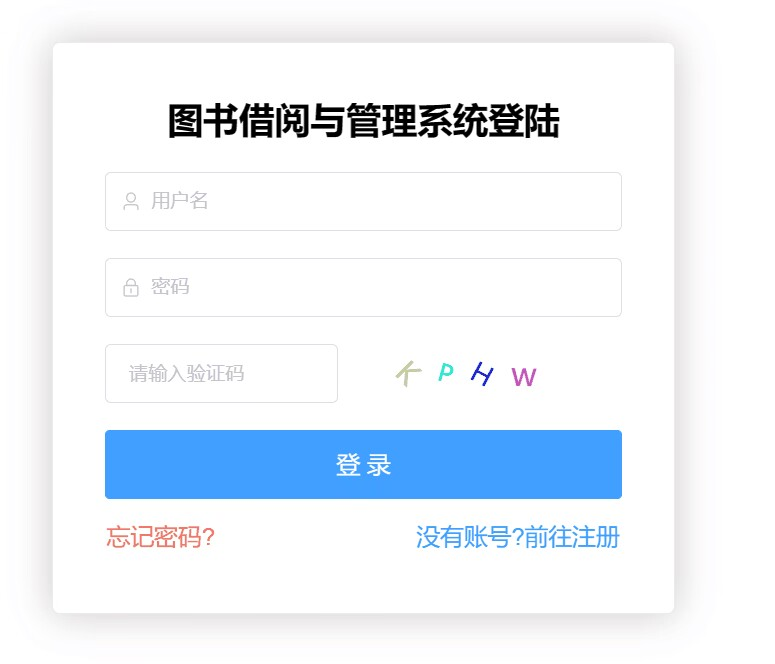
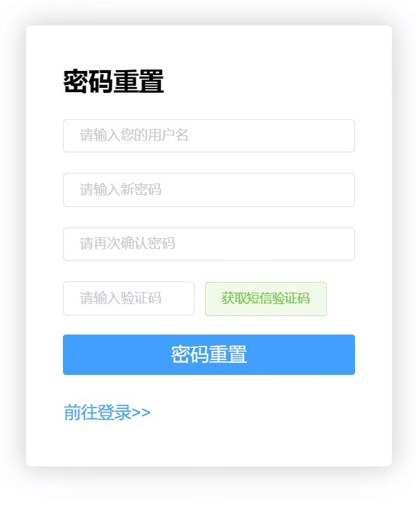
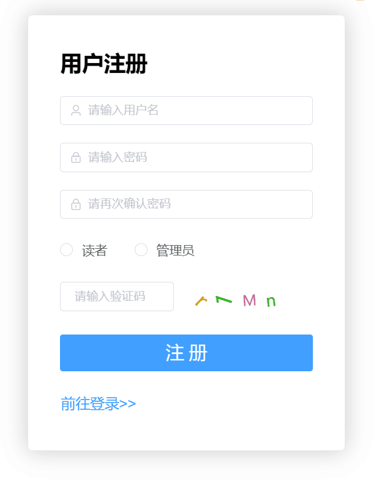
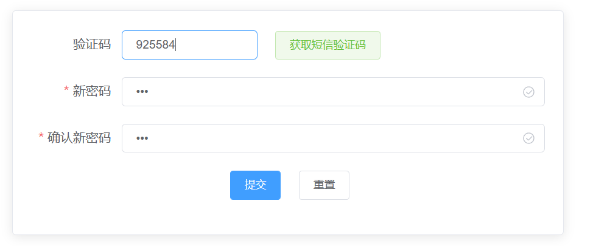
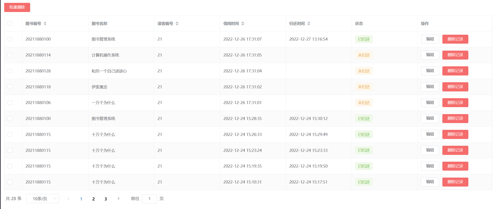
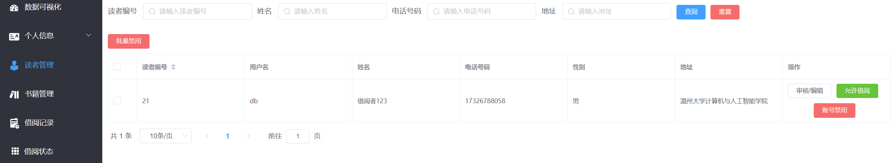

# 图书馆管理系统 (library-system)

一个基于 SpringBoot、Mybatis-Plus、MySQL、Vue3、ElementPlus、Redis 和 Docker容器 构建的完整图书馆管理系统。

## ✨ 技术栈

*   **后端:**
    *   SpringBoot
    *   Mybatis-Plus
    *   MySQL
*   **前端:**
    *   Vue3
    *   ElementPlus

## 🎯 主要功能

### 管理员模块

*   **用户管理:**
    *   注册、登录
    *   修改个人信息
    *   手机号绑定
    *   修改或找回密码（手机号验证码）
*   **书籍管理:**
    *   书籍信息维护（增删改查）
*   **读者管理:**
    *   读者信息维护（增删改查）
*   **借阅管理:**
    *   借阅记录管理（查询、审核）
    *   借阅者权限管理
    *   借阅状态管理

### 读者模块

*   **用户管理:**
    *   注册、登录
    *   修改个人信息
    *   手机号绑定
    *   修改或找回密码（手机号验证码）
*   **图书管理:**
    *   查询图书信息
    *   借阅和归还图书
*   **个人中心:**
    *   查看个人借阅记录

## 📁 代码结构

### 前端 (library-ui)

```
library-ui
├── api          // API 接口定义
├── assets       // 静态资源文件
│   ├── icon     // 图标
│   ├── img      // 图片
│   └── styles   // 样式文件
├── components   // 自定义 Vue 组件
├── layout       // 页面布局组件
├── router       // Vue 路由配置
├── utils        // 工具函数
└── views        // 页面视图组件
```

### 后端 (library-serve)

```
library-serve
└── java
    └── com
        └── admin
            └── library
                ├── common       // 通用类
                │   ├── base     // 基础类
                │   └── config   // 配置类
                ├── controller   // 控制层
                ├── domain       // 实体类
                ├── mapper       // 持久层
                └── service      // 业务层
└── resources   // Maven 资源配置
```

## 🚀 启动说明

### 前端

1.  进入 `library-ui` 目录。
2.  安装依赖：`npm install`
3.  启动项目：`npm run serve`
4.  打包项目：`npm run build` (生成 `dist` 目录用于部署)

### 后端

1.  **数据库:**
    *   运行根目录下的 SQL 文件创建数据库和表。
    *   确保数据库连接配置正确。
2.  **Redis:**
    *   启动本地 Redis 服务（用于短信验证码功能，可使用 Windows Redis 应用或 Docker 部署）。
3.  **短信服务 (可选):**
    *   添加阿里云短信服务 Key 和 pwd。
    *   **注意：** 如果不使用短信服务，请注释相关代码，否则可能会报错。
    *   查看 Issues 了解更多：[短信服务相关问题](https://github.com/wzunjh/Library-Management-System/issues/1)
4.  **启动后端:**
    *   运行 SpringBoot 启动类。
5. **问题排查：**
    * 如果报错显示阿里云短信请求不存在（或者你不想使用该功能），请查看 Issues 中的解决方案：[点击这里](https://github.com/wzunjh/Library-Management-System/issues/1)

## 🖼️ 部分页面展示

|  |  |  |
|---|---|---|
|   |    |  |
|  |   |   |





